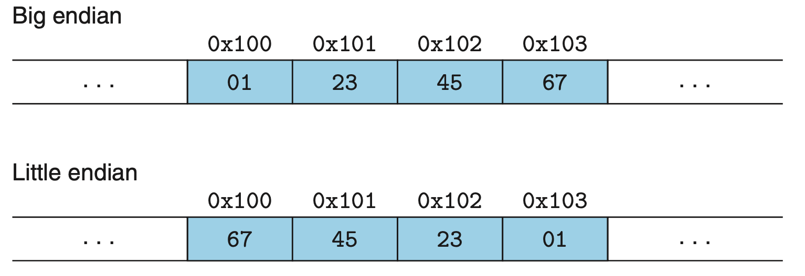

Conputer System Concepts, 2022 Spring.

W Kong,

Software Engineering 2002,

Xi'an Univercity of Science and Technology.

Textbook: ***Conputer System: A Programmer's Prospective***

# Chapter 2 Representing and Manipulating Information
> Tirck: Leonardo Pisano (ca. 1170 to ca. 1250), better known as Fibonacci


Three most important representations of numbers: `unsigned`, `signed`, `floating-point`.

Some operations can overflow when the results are too large to be represented. Like, 
```
200 * 300 * 400 * 500
```
yields −884,901,888.

`Floating-point arithmetic` is not associative due to the finite precision of the representation.
For example, the C expression `(3.14+1e20)-1e20` will evaluate to `0.0` on most machines, while `3.14+(1e20- 1e20)` will evaluate to `3.14`. 

Computers use several different binary representations to encode numeric values. (See in Chapter3).

> The C++ programming language is built upon C, using the exact same numeric representations and operations. The Java language definition created a new set of standards for numeric representations and operations.


## 2.1 Information Storage

 Most computers use blocks of 8 bits, or bytes, as the smallest addressable unit of memory instead of accessing each individual bits in memory.

A machine-level program views memory as a very large array of bytes, referred to as `virtual memory`. Every byte of memory is identified by a unique number, known as its `address`, and the set of all possible addresses is known as the `virtual address space`.

>It is a technique that is implemented using both hardware and software. It maps memory addresses used by a program, called virtual addresses, into physical addresses in computer memory. All memory references within a process are logical addresses that are dynamically translated into physical addresses at run time. This means that a process can be swapped in and out of the main memory such that it occupies different places in the main memory at different times during the course of execution. A process may be broken into a number of pieces and these pieces need not be continuously located in the main memory during execution. The combination of dynamic run-time address translation and use of page or segment table permits this. 

from [geeksforgeeks](https://www.geeksforgeeks.org/virtual-memory-in-operating-system/?ref=gcse)

The C compiler <u>associates type information</u> with each pointer whether it points to an integer, a structure, or some other program object—is the virtual address of the first byte of some block of storage.

> Although the C compiler maintains this type information, the actual machine-level program it generates has no information about data types. It simply treats each program object as a block of bytes and the program itself as a sequence of bytes.

### 2.1.1 Hexadecimal Notation

A single byte consists of 8 bits whose value ranges from 000000002 to 111111112. When viewed as a decimal integer, its value ranges from 0<sub>10</sub> to 255<sub>10</sub>.

Binary code is too long and too verbose that we usually use `hexadecimal` numbers to represent binaries.

> We use hexadecimal because every 4-bit binary number just quals a single hex-digit number. Like 0000<sub>2</sub> euals 0<sub>16</sub> and 1111<sub>2</sub> euals F<sub>16</sub> 

Example:
Suppose a given the number `0x173A4C`

|||||||
|-|-|-|-|-|-|
|Hexadecimal|1|7|3|A|4|C|
|Binary| 0001| 0111 |0011 |1010 |0100 |1100|

This gives the binary representation `000101110011101001001100`.

Conversely, given a binary number `1111001010110110110011`,

|||||||
|-|-|-|-|-|-|
|Binary |11 |1100 |1010 |1101| 1011 |0011|
|Hexadecimal| 3| C |A |D |B |3|

The result is `0x3CADB`.

### 2.1.2 Data Sizes

Every computer has a `word` size, indicating the nominal size of `pointer` data, which caps the maximum size of the virtual memory address of a computer. For a machine with a w-bit word size, the virtual addresses can range from 0 to 2 <sup>w</sup>-1, giving the program access to at most 2<sup>w</sup> bytes.

Nowadays the most common personal computers run on  64-bit machines and systems while 32-bit is becoming less and less. And the maximum memory size extends from 2<sup>32</sup> bits (4 *Gigabits*) to 2<sup>64</sup> bits (16 *Exabytes*).

> Meanwhile, many of 64-bit operating systems still support 32-bit programs.

When you try to compile a C program, use
```cml
linux> gcc -m32 prog.c

linux> gcc -m64 prog.c

```
to compile programs with spercific word-size.

Typical data size in C declaration:
|||||
|-|-|-|-|
|signed|unsigned|32-bit|64-bit|
|char|unsigned char|1|1|
|short|unsigned short|2|2|
|int|unsigned|4|<u>***4***</u>|
|long|unsigned long|<u>***4***</u>|8|
|**`int32_t`**|**`uint32_t`**|4|4|
|**`int64_t`**|**`uint64_t`**|8|8|
|char *||4|8|
|float||4|4|
|double||8|8|

> `int` on a ***64-bit*** machine occupies 4 bytes
> 
> `int` and `long` on a ***32-bit*** machine have the same memory size and range
> 
> To avoid the vagaries of relying on “typical” sizes and different compiler settings, ISO C99 introduced a class of data types where the data sizes are fixed regardless of compiler and machine settings. Among these are data types int32_t and int64_t, having exactly 4 and 8 bytes, respectively. Using fixed-size integer types is the best way for programmers to have close control over data represen- tations.

> Aside: With the transition to 64-bit machines, many hidden word size dependencies have arisen as bugs in migrating these programs to new machines. For example, many programmers historically assumed that an object declared as type int could be used to store a pointer. This works fine for most 32-bit programs, but it leads to problems for 64-bit programs.


The C language allows a variety of ways to order the keywords and to include or omit optional keywords. These declarations have identical meaning:
```c
unsigned long var;
unsigned long int var;
long unsigned var;
long unsigned int var;
```

### 2.1.3 Addressing and Byte Ordering

 We must establish two conventions: 
 - what the address of the object will be
 - and how we will order the bytes in memory.

In virtually all machines, a multi-byte object is stored as a **contiguous sequence** of bytes.

`Little endian` and `Big endian` are two ways of storing multibyte data-types ( int, float, etc). In little endian machines, last byte of binary representation of the multibyte data-type is stored first. On the other hand, in big endian machines, first byte of binary representation of the multibyte data-type is stored first. 
Suppose integer is stored as 4 bytes then a variable x with value 0x01234567 will be stored as following.



> **Most** Intel-compatible machines operate exclusively in little-endian mode. On the other hand, most machines from IBM and Oracle (arising from their acquisition of Sun Microsystems in 2010) operate in big-endian mode.
> 
> Many recent microprocessor can operate as either little- or big-endian machines, aka `bi-endian`.


## 2.2 Integer Representations 
## 2.3 Integer Arithmetic 
## 2.4 Floating Point 
## 2.5 Summary